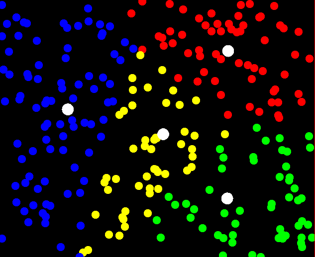

# K-Means Animation

This is an animation showing how the K-means algorithm works. You can
place new "means" by clicking.

Hitting "3" adjusts each point to be associated to the nearest "mean",
and then moves the "means" to the center of its group. "D" increases
the number of points visible on the screen, which shows the regions
pretty well.

## Controls

* `1`: Recalculate the group for each point. (Recolors the points.)
* `2`: Recalculate the centroids for each group. (Moves the centers.)
* `3`: Combines both 1 and 2, for easy slow stepping.
* `R`: Re-randomizes all of the data.
* `+`: Adds another group with a random center. (Does not recalculate.)
* `-`: Removes a group. (Does not recalculate; points in that group turn white.)
* `D`: Add 50 more random points.
* `A`: Remove the last 50 points placed.
   The window is 800x800 by default, because that looks good on my screen.
* `Esc`: Quit.
* Clicking the mouse places the center for another group and recalculates all groups.

## Running the Code

If you are lucky, `gradlew run` will download and install everything
you need.

## Example output

Four regions and 250 points.

## Javascript Translation

One shot Gemini translation.

 1: Recalculate Groups | 2: Recalculate Centroids | 3: Both 
 R: Re-randomize | +: Add Group | -: Remove Group 
 D: Add Points | A: Remove Points | Click: Place Centroid

<canvas id="canvas"></canvas>

